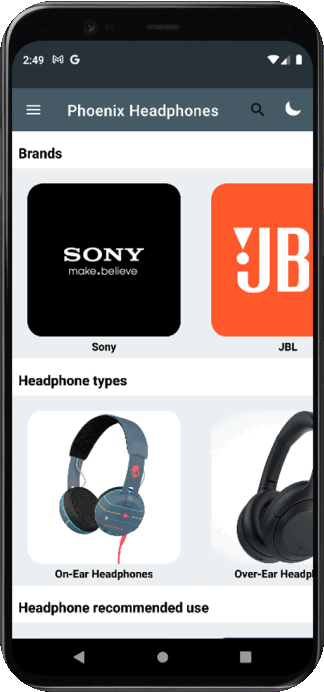

# Phoenix Headphones
## Project Overview

**Phoenix Headphones** is an Android application designed for selling headphones and exploring various brands, making it easier for shoppers to make informed decisions. This app provides a unique platform focused solely on headphones, allowing users to freely explore the latest models available in the market.

## Features

- **User Notifications**: Send notifications to all users directly from the Firebase dashboard, which pop up on the screen.
- **Category Browsing**: Users can browse different headphone categories sorted by brand, type, materials, and connectivity type.
- **Shopping Cart**: Add headphones to a cart for easy checkout at the end of the shopping experience.
- **Search Functionality**: Quickly find desired headphones using a search panel.
- **Dark Mode**: Choose between light and dark modes, with an option for automatic activation based on ambient light conditions (toggle button named "Auto Dark Mode").
- **User Authentication**: Users can sign in, log in, and log out using email and password, with email verification required.
- **Brand Descriptions**: Comprehensive descriptions of each headphone brand are provided.
- **Personal Notes**: Users can leave notes for themselves about headphones and update or remove them as needed.
- **Help Section**: A "Help" section allows users to send messages to developers and includes an intent to call support.

## Technical Details

### Development Environment

- **Android Studio Version**: 2020.3.1
- **Compile SDK Version**: 31
- **Gradle Version**: 7.0.2
- **Android Gradle Plugin Version**: 7.0.3

### Key Components Used

- **Firebase Authentication**
- **RecyclerView**
- **Navigation Drawer**
- **SharedPreferences**
- **SQLite/Room**
- **Bottom Sheet**
- **Broadcast Receiver**

## User Interface

The app features a user-friendly interface with:
- A toolbar and navigation drawer.
- Nested RecyclerViews for displaying different categories of headphones.
- A search icon for quick item searches.

### Main UI Flow

1. The main UI displays categories of headphones using a nested RecyclerView.
2. Users can navigate through various fragments like Cart, Brands, Self Notes, My Account, and Help.
3. The Help section consists of three tabs for user assistance.

## Installation

1. Clone this repository:
   ```bash
   git clone https://github.com/FarnoodID/AndroidAppHeadphones.git
   ```
2. Open the project in Android Studio.
3. Ensure you have the required SDK versions installed.
4. Sync the project with Gradle files.
6. Run the application on an emulator or physical device.


